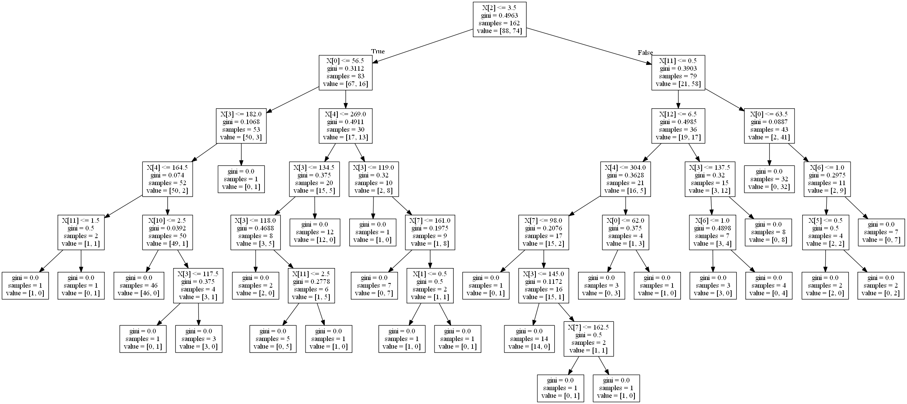

Assignment 1 - Machine Learning for Data Analysis
======

Description of Dataset
----

## Source ##
For this assignment the Statlog (Heart) Data Set ([Link](https://archive.ics.uci.edu/ml/datasets/Statlog+%28Heart%29)) obtained from [UCI Machine Learning Repository](https://archive.ics.uci.edu/ml/datasets.html) is used. 


## Description
### Attribute Information:
 1. age
 2. sex
 3. chest pain type  (4 values)
 4. resting blood pressure
 5. serum cholestoral in mg/dl
 6. fasting blood sugar > 120 mg/dl
 7. resting electrocardiographic results  (values 0,1,2)
 8. maximum heart rate achieved
 9. exercise induced angina
 10. oldpeak = ST depression induced by exercise relative to rest
 11. the slope of the peak exercise ST segment
 12. number of major vessels (0-3) colored by flourosopy
 13. thal: 3 = normal; 6 = fixed defect; 7 = reversable defect
 
### Variable to be predicted
Absence (1) or presence (2) of heart disease

# Code


```python
#Importing Pandas
from pandas import Series, DataFrame
import pandas as pd

#Importing NumPy
import numpy as np

# Matplotlib to plot
import matplotlib.pylab as plt

#Importing sklearn 
from sklearn.cross_validation import train_test_split
from sklearn.tree import DecisionTreeClassifier
from sklearn.metrics import classification_report
import sklearn.metrics

```

Reading the dataset as raw_data as assigning names of attributes to each coloumn. Also visualising at top five rows of the data. 


```python
raw_data = pd.read_csv("heart.dat", delimiter=' ', names = ["age", "sex", "chestPainType", "RestBP", "SerumCholesterol", "FastingBP", "RestingECG", "MaxHR", "ExerciseInduceAgina", "Oldepeak", "SlopSTSegment", "NoVessels", "Thal", "Result"])

raw_data.head()
```


<div>
<table border="1" class="dataframe">
  <thead>
    <tr style="text-align: right;">
      <th></th>
      <th>age</th>
      <th>sex</th>
      <th>chestPainType</th>
      <th>RestBP</th>
      <th>SerumCholesterol</th>
      <th>FastingBP</th>
      <th>RestingECG</th>
      <th>MaxHR</th>
      <th>ExerciseInduceAgina</th>
      <th>Oldepeak</th>
      <th>SlopSTSegment</th>
      <th>NoVessels</th>
      <th>Thal</th>
      <th>Result</th>
    </tr>
  </thead>
  <tbody>
    <tr>
      <th>0</th>
      <td>70.0</td>
      <td>1.0</td>
      <td>4.0</td>
      <td>130.0</td>
      <td>322.0</td>
      <td>0.0</td>
      <td>2.0</td>
      <td>109.0</td>
      <td>0.0</td>
      <td>2.4</td>
      <td>2.0</td>
      <td>3.0</td>
      <td>3.0</td>
      <td>2</td>
    </tr>
    <tr>
      <th>1</th>
      <td>67.0</td>
      <td>0.0</td>
      <td>3.0</td>
      <td>115.0</td>
      <td>564.0</td>
      <td>0.0</td>
      <td>2.0</td>
      <td>160.0</td>
      <td>0.0</td>
      <td>1.6</td>
      <td>2.0</td>
      <td>0.0</td>
      <td>7.0</td>
      <td>1</td>
    </tr>
    <tr>
      <th>2</th>
      <td>57.0</td>
      <td>1.0</td>
      <td>2.0</td>
      <td>124.0</td>
      <td>261.0</td>
      <td>0.0</td>
      <td>0.0</td>
      <td>141.0</td>
      <td>0.0</td>
      <td>0.3</td>
      <td>1.0</td>
      <td>0.0</td>
      <td>7.0</td>
      <td>2</td>
    </tr>
    <tr>
      <th>3</th>
      <td>64.0</td>
      <td>1.0</td>
      <td>4.0</td>
      <td>128.0</td>
      <td>263.0</td>
      <td>0.0</td>
      <td>0.0</td>
      <td>105.0</td>
      <td>1.0</td>
      <td>0.2</td>
      <td>2.0</td>
      <td>1.0</td>
      <td>7.0</td>
      <td>1</td>
    </tr>
    <tr>
      <th>4</th>
      <td>74.0</td>
      <td>0.0</td>
      <td>2.0</td>
      <td>120.0</td>
      <td>269.0</td>
      <td>0.0</td>
      <td>2.0</td>
      <td>121.0</td>
      <td>1.0</td>
      <td>0.2</td>
      <td>1.0</td>
      <td>1.0</td>
      <td>3.0</td>
      <td>1</td>
    </tr>
  </tbody>
</table>
</div>


```python
raw_data.describe()
```


<div>
<table border="1" class="dataframe">
  <thead>
    <tr style="text-align: right;">
      <th></th>
      <th>age</th>
      <th>sex</th>
      <th>chestPainType</th>
      <th>RestBP</th>
      <th>SerumCholesterol</th>
      <th>FastingBP</th>
      <th>RestingECG</th>
      <th>MaxHR</th>
      <th>ExerciseInduceAgina</th>
      <th>Oldepeak</th>
      <th>SlopSTSegment</th>
      <th>NoVessels</th>
      <th>Thal</th>
      <th>Result</th>
    </tr>
  </thead>
  <tbody>
    <tr>
      <th>count</th>
      <td>270.000000</td>
      <td>270.000000</td>
      <td>270.000000</td>
      <td>270.000000</td>
      <td>270.000000</td>
      <td>270.000000</td>
      <td>270.000000</td>
      <td>270.000000</td>
      <td>270.000000</td>
      <td>270.00000</td>
      <td>270.000000</td>
      <td>270.000000</td>
      <td>270.000000</td>
      <td>270.000000</td>
    </tr>
    <tr>
      <th>mean</th>
      <td>54.433333</td>
      <td>0.677778</td>
      <td>3.174074</td>
      <td>131.344444</td>
      <td>249.659259</td>
      <td>0.148148</td>
      <td>1.022222</td>
      <td>149.677778</td>
      <td>0.329630</td>
      <td>1.05000</td>
      <td>1.585185</td>
      <td>0.670370</td>
      <td>4.696296</td>
      <td>1.444444</td>
    </tr>
    <tr>
      <th>std</th>
      <td>9.109067</td>
      <td>0.468195</td>
      <td>0.950090</td>
      <td>17.861608</td>
      <td>51.686237</td>
      <td>0.355906</td>
      <td>0.997891</td>
      <td>23.165717</td>
      <td>0.470952</td>
      <td>1.14521</td>
      <td>0.614390</td>
      <td>0.943896</td>
      <td>1.940659</td>
      <td>0.497827</td>
    </tr>
    <tr>
      <th>min</th>
      <td>29.000000</td>
      <td>0.000000</td>
      <td>1.000000</td>
      <td>94.000000</td>
      <td>126.000000</td>
      <td>0.000000</td>
      <td>0.000000</td>
      <td>71.000000</td>
      <td>0.000000</td>
      <td>0.00000</td>
      <td>1.000000</td>
      <td>0.000000</td>
      <td>3.000000</td>
      <td>1.000000</td>
    </tr>
    <tr>
      <th>25%</th>
      <td>48.000000</td>
      <td>0.000000</td>
      <td>3.000000</td>
      <td>120.000000</td>
      <td>213.000000</td>
      <td>0.000000</td>
      <td>0.000000</td>
      <td>133.000000</td>
      <td>0.000000</td>
      <td>0.00000</td>
      <td>1.000000</td>
      <td>0.000000</td>
      <td>3.000000</td>
      <td>1.000000</td>
    </tr>
    <tr>
      <th>50%</th>
      <td>55.000000</td>
      <td>1.000000</td>
      <td>3.000000</td>
      <td>130.000000</td>
      <td>245.000000</td>
      <td>0.000000</td>
      <td>2.000000</td>
      <td>153.500000</td>
      <td>0.000000</td>
      <td>0.80000</td>
      <td>2.000000</td>
      <td>0.000000</td>
      <td>3.000000</td>
      <td>1.000000</td>
    </tr>
    <tr>
      <th>75%</th>
      <td>61.000000</td>
      <td>1.000000</td>
      <td>4.000000</td>
      <td>140.000000</td>
      <td>280.000000</td>
      <td>0.000000</td>
      <td>2.000000</td>
      <td>166.000000</td>
      <td>1.000000</td>
      <td>1.60000</td>
      <td>2.000000</td>
      <td>1.000000</td>
      <td>7.000000</td>
      <td>2.000000</td>
    </tr>
    <tr>
      <th>max</th>
      <td>77.000000</td>
      <td>1.000000</td>
      <td>4.000000</td>
      <td>200.000000</td>
      <td>564.000000</td>
      <td>1.000000</td>
      <td>2.000000</td>
      <td>202.000000</td>
      <td>1.000000</td>
      <td>6.20000</td>
      <td>3.000000</td>
      <td>3.000000</td>
      <td>7.000000</td>
      <td>2.000000</td>
    </tr>
  </tbody>
</table>
</div>


Creating dataframe without the target (col name = results)


```python
predictors = raw_data.drop(["Result"], axis=1)
#Shape of the data.
predictors.shape
```


    (270, 13)


Storing target values in new array


```python
targets = raw_data.Result
```

Splitting data into training and test set 60:40. 


```python
pred_train, pred_test, tar_train, tar_test = train_test_split(predictors, targets, test_size=.4)
```


```python
print (pred_train.shape,pred_test.shape,tar_train.shape,tar_test.shape)
```

    (162, 13) (108, 13) (162,) (108,)
    

Defining and fitting the decision tree


```python
clf = DecisionTreeClassifier()
clf = clf.fit(pred_train, tar_train)
```

making preditions for the test set. 


```python
predictions=clf.predict(pred_test)
```

Printing the confusion metrics. 


```python
sklearn.metrics.confusion_matrix(tar_test,predictions)
```


    array([[48, 14],
           [14, 32]])


**The results shows the model has correctly predicted 48 True Postive and 32 True Negatives. But, there are 28 False predictions (14 each in FP and FN).**


```python
sklearn.metrics.accuracy_score(tar_test, predictions)
```


    0.78703703703703709


**Overall accurace of the model is around 79%.**

## Plotting Decision Tree.


```python
from sklearn import tree
from io import StringIO
from IPython.display import Image

out = StringIO()
tree.export_graphviz(clf, out_file=out)
import pydotplus
graph=pydotplus.graph_from_dot_data(out.getvalue())
Image(graph.create_png())

```





